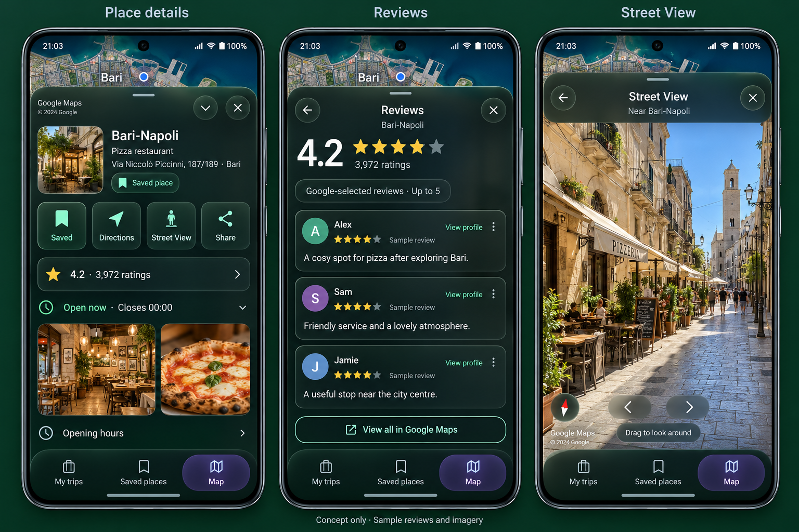

# Reviews and Street View concept

[Open the full-size image](reviews-street-view.png)

Design visualization for discussion; these features have not been implemented.

- Place details: Street View tile immediately after Directions, and a tappable rating summary.
- Reviews: a separate draggable card with up to five Google-selected reviews and a link to Google Maps.
- Street View: a separate panorama card with its drag handle outside the viewing area.

The image is AI-generated. Reviews, imagery, opening times, attribution placement and panorama controls are illustrative; final implementation will use provider data, required attribution and supported controls.
